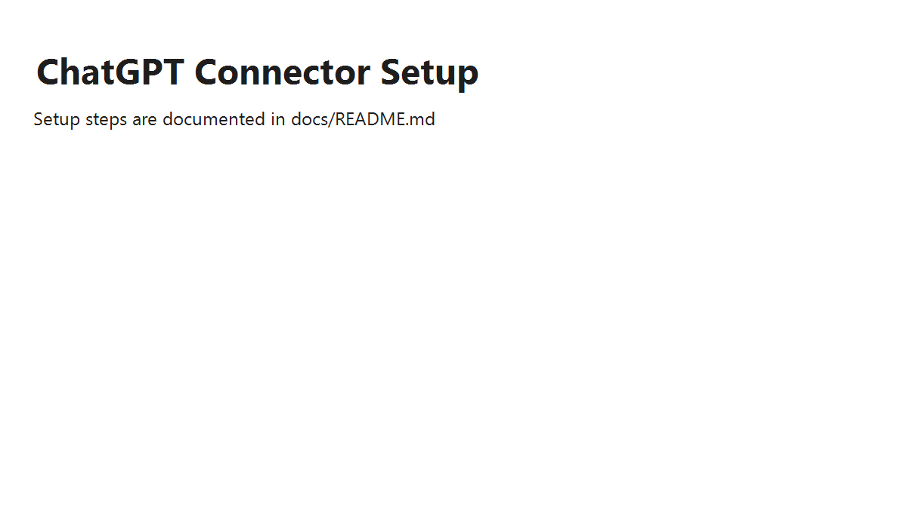
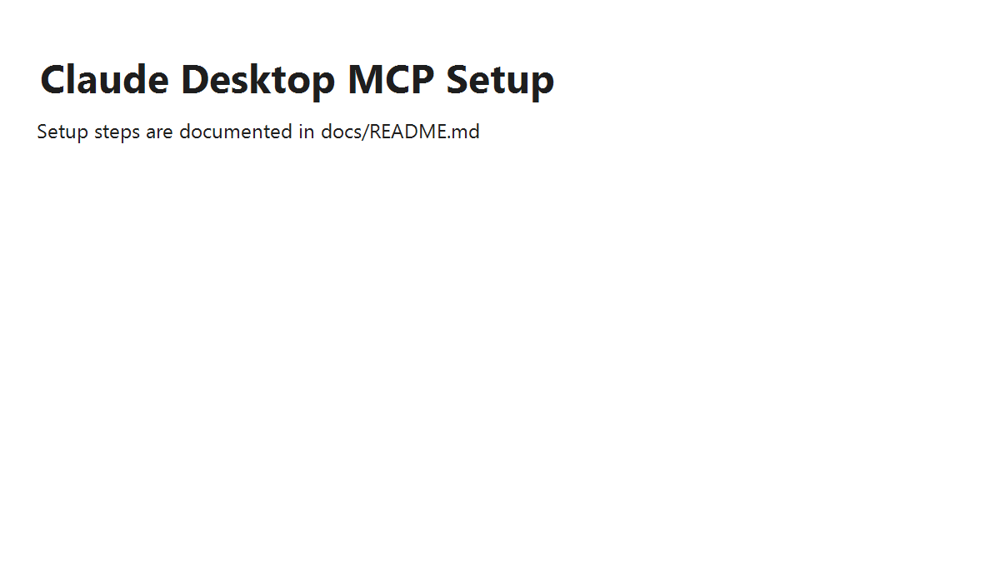
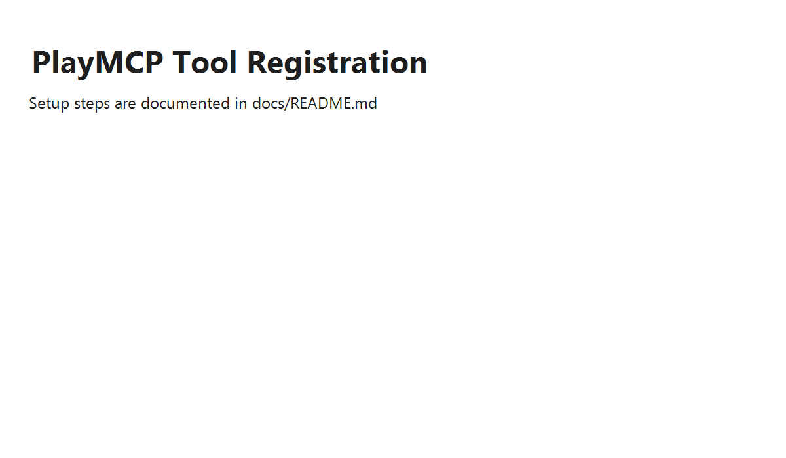
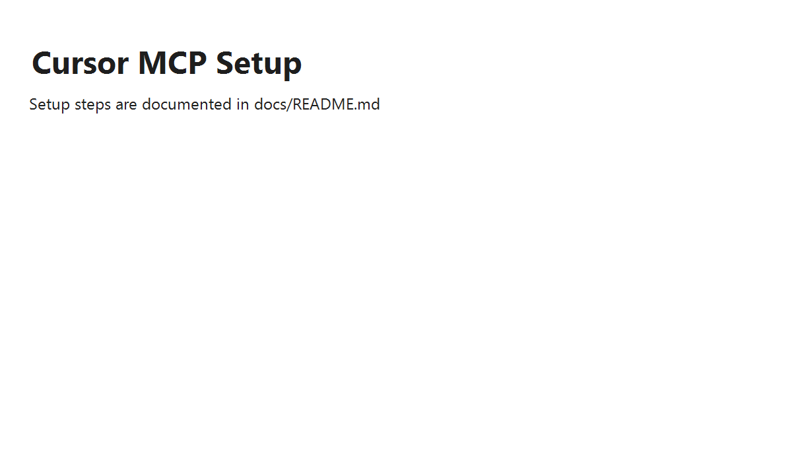

# HWP MCP Server User Guide

## 한국어

### 설치

```bash
npm install
npm run build
```

### 실행

```bash
node dist/index.js
```

### HTTP/SSE 모드 (PlayMCP 등)

PlayMCP 심사용 공개 URL이 필요한 경우 HTTP/SSE 모드로 실행합니다.

```bash
MCP_TRANSPORT=http MCP_PORT=8787 node dist/index.js
```

- SSE 엔드포인트: `http://HOST:8787/sse`
- 메시지 엔드포인트: `http://HOST:8787/message`
- 헬스 체크: `http://HOST:8787/health`

### ChatGPT Connector 연결

1. ChatGPT 설정에서 MCP Connector 추가를 선택합니다.
2. 실행 명령에 `node /absolute/path/to/dist/index.js`를 입력합니다.
3. 저장 후 새 대화에서 `read_hwp`, `read_hwpx`, `convert_to_docx`를 호출합니다.



### Claude Desktop 연결

1. Claude Desktop 설정 파일을 엽니다.
   - Windows: `%APPDATA%\\Claude\\claude_desktop_config.json`
   - macOS: `~/Library/Application Support/Claude/claude_desktop_config.json`
2. MCP 서버 항목을 추가합니다.

```json
{
  "mcpServers": {
    "hwp": {
      "command": "node",
      "args": ["/absolute/path/to/dist/index.js"]
    }
  }
}
```



### PlayMCP 등록

1. PlayMCP 도구 등록 화면에서 로컬 MCP 서버를 선택합니다.
2. 실행 명령에 `node /absolute/path/to/dist/index.js`를 입력합니다.
3. 도구 이름과 설명을 입력한 뒤 등록합니다.



### Cursor 연결

1. 프로젝트 루트에 `.cursor/mcp.json`을 추가합니다.
2. 아래 예시처럼 서버를 등록합니다.

```json
{
  "mcpServers": {
    "hwp": {
      "command": "node",
      "args": ["/absolute/path/to/dist/index.js"]
    }
  }
}
```



### 주요 사용 예시

```text
read_hwp { "filePath": "/path/to/document.hwp" }
read_hwpx { "filePath": "/path/to/document.hwpx" }
convert_to_docx { "filePath": "/path/to/document.hwp", "outputPath": "/path/to/output.docx" }
```

## English

### Installation

```bash
npm install
npm run build
```

### Run

```bash
node dist/index.js
```

### HTTP/SSE Mode (PlayMCP)

Run HTTP/SSE mode when a public URL is required.

```bash
MCP_TRANSPORT=http MCP_PORT=8787 node dist/index.js
```

- SSE endpoint: `http://HOST:8787/sse`
- Message endpoint: `http://HOST:8787/message`
- Health check: `http://HOST:8787/health`

### ChatGPT Connector Setup

1. Add a new MCP Connector in ChatGPT settings.
2. Set the command to `node /absolute/path/to/dist/index.js`.
3. Save and use `read_hwp`, `read_hwpx`, or `convert_to_docx`.


### Claude Desktop Setup

1. Open the Claude Desktop configuration file.
   - Windows: `%APPDATA%\\Claude\\claude_desktop_config.json`
   - macOS: `~/Library/Application Support/Claude/claude_desktop_config.json`
2. Add the MCP server entry.

```json
{
  "mcpServers": {
    "hwp": {
      "command": "node",
      "args": ["/absolute/path/to/dist/index.js"]
    }
  }
}
```


### PlayMCP Registration

1. Choose local MCP server registration.
2. Set the command to `node /absolute/path/to/dist/index.js`.
3. Provide a name and description, then register.


### Cursor Setup

1. Add `.cursor/mcp.json` to the project root.
2. Register the server with the following config.

```json
{
  "mcpServers": {
    "hwp": {
      "command": "node",
      "args": ["/absolute/path/to/dist/index.js"]
    }
  }
}
```


### Example Usage

```text
read_hwp { "filePath": "/path/to/document.hwp" }
read_hwpx { "filePath": "/path/to/document.hwpx" }
convert_to_docx { "filePath": "/path/to/document.hwp", "outputPath": "/path/to/output.docx" }
```
